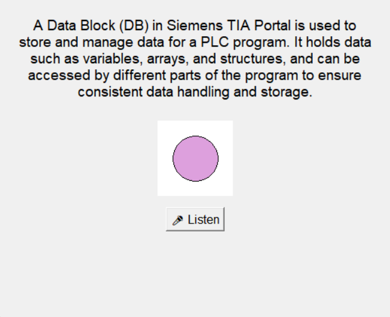

# Instructional Assistant

Instructional Assistant is a Windows desktop program that listens to a live class and answers spoken questions out loud, using the OpenAI Realtime API. I built it so an instructor can get a short, accurate answer during a lecture or lab without stopping to type.

The window has one button and a circle. The circle pulses blue while the assistant listens and violet while it speaks. The assistant waits for a pause before it answers, and it pauses the microphone while it talks so it does not hear its own voice.

Two teaching profiles ship with it:

- `automation`: industrial automation training (PLC programming, TIA Portal, PROFINET, commissioning).
- `academic`: biology, anatomy and physiology, statistics, and scientific literacy.

> Independent project. This is a personal project by Dr. Reginald Finley. Siemens has not reviewed, approved, or endorsed it. Siemens, SIMATIC, TIA Portal, WinCC, and ET 200SP are trademarks of Siemens AG and are named here only to describe the subject matter the assistant covers.

## Demo



The screenshot shows the assistant after answering "What is a data block in TIA Portal?" The violet circle means it is speaking.

## Hardware required

- A Windows 10 or 11 PC. The code is plain Python and may run on macOS or Linux, but it has only been tested on Windows.
- A microphone and speakers. A headset reduces echo in a classroom.
- An internet connection.

## Software required

- Python 3.12 (tested with 3.12.2)
- An OpenAI account with API access and a paid balance. Realtime voice usage is billed per minute of audio; see https://openai.com/api/pricing
- Python packages in `requirements.txt` (openai 1.97.1, websockets 15.0.1, sounddevice 0.5.2, numpy 2.3.2, pygame 2.6.1, python-dotenv 1.1.1)
- Optional: PyInstaller 6.14.2 to build a double-click `.exe`

## Installation

Open PowerShell in the folder where you want the project.

```powershell
git clone https://github.com/USERNAME/instructional-assistant.git
cd instructional-assistant
py -3.12 -m venv .venv
.\.venv\Scripts\Activate.ps1
pip install -r requirements.txt
```

If PowerShell blocks the activation script, run `Set-ExecutionPolicy -Scope CurrentUser RemoteSigned` once and try again.

## Configuration

Copy the example settings file and edit it:

```powershell
copy .env.example .env
notepad .env
```

| Setting | What it does |
| --- | --- |
| `OPENAI_API_KEY` | Your OpenAI API key. If you leave it blank, the app asks for the key at startup and keeps it in memory only. |
| `REALTIME_MODEL` | The realtime voice model. Model names change; check the OpenAI models page if you get a connection error. |
| `ASSISTANT_VOICE` | The voice for spoken replies. |
| `ASSISTANT_PROFILE` | `automation` or `academic`. Each name matches a file in `profiles/`. |
| `WINDOW_TITLE` | The title bar text. |

To make your own profile, copy one of the files in `profiles/`, edit the instructions, and set `ASSISTANT_PROFILE` to the new file name without `.md`.

## Usage

```powershell
python instructional_assistant.py
```

1. Press **Listen**. The console prints `[Realtime] Connected` and `[Mic] Streaming`.
2. Ask a question, then pause. After about 1.6 seconds of silence the assistant answers.
3. Press **Stop** to end the session, or close the window to quit.

Example: "What is the difference between an FC and an FB?" The `automation` profile answers in two to five sentences.

### Build a double-click executable

```powershell
pip install pyinstaller==6.14.2
pyinstaller packaging/instructional_assistant.spec
```

The program is written to `dist\InstructionalAssistant.exe`. Put a `.env` file in the same folder as the `.exe`, or let it ask for the key when it starts. Create a desktop shortcut to the `.exe` for one-click launch.

## Project layout

```
instructional-assistant/
  instructional_assistant.py   main program: window, microphone, realtime session, playback
  profiles/
    automation.md              system instructions for industrial automation classes
    academic.md                system instructions for science and statistics classes
  packaging/
    instructional_assistant.spec   PyInstaller build file
  docs/
    screenshot.png
  .env.example                 settings template
  requirements.txt
  LICENSE
```

## History

The project started in 2025 as SIA (Siemens Instructor Assistant), a proof of concept for instructor-led industrial automation training. The first version used Google speech recognition, a "Hey SIA" wake word, the OpenAI chat API, and OpenAI text-to-speech. Each answer took three to five seconds, which is a long wait in front of a class.

The second generation moved to the OpenAI Realtime API over a WebSocket, streaming 24 kHz microphone audio and playing the reply as it arrived. That version reused the continuous audio and debounce logic from my earlier desktop assistant, Aurora (now Project AION).

A companion design, GAIA (General Academic Instruction Assistant), covered science and statistics teaching. This repository combines the two: one program, with the subject area chosen by a profile file.

## Credits

The code in this repository was written for this project. It depends on these libraries and services:

| Component | Author | License |
| --- | --- | --- |
| [openai-python](https://github.com/openai/openai-python) and the OpenAI Realtime API | OpenAI | Apache 2.0 (library); API use under OpenAI's terms |
| [websockets](https://github.com/python-websockets/websockets) | Aymeric Augustin and contributors | BSD 3-Clause |
| [python-sounddevice](https://github.com/spatialaudio/python-sounddevice) | Matthias Geier | MIT |
| [pygame](https://github.com/pygame/pygame) | pygame community | LGPL 2.1 |
| [NumPy](https://github.com/numpy/numpy) | NumPy developers | BSD 3-Clause |
| [python-dotenv](https://github.com/theskumar/python-dotenv) | Saurabh Kumar and contributors | BSD 3-Clause |
| [PyInstaller](https://github.com/pyinstaller/pyinstaller) (build only) | PyInstaller team | GPL 2.0 with bootloader exception |

Parts of the code were drafted with help from ChatGPT (OpenAI), Gemini (Google), and Claude (Anthropic). Gemini suggested the shutdown design that lets the window close while the microphone thread is running.

## Modifications in this release

Changes from the SIA code I ran in class:

- Renamed the program and removed Siemens branding from the window and the assistant's persona.
- Moved the system instructions out of the code into `profiles/`, and added the `academic` profile from the GAIA design.
- The API key now comes from `OPENAI_API_KEY` or a startup prompt. It is never written to disk. The old version saved it in plain text in `sia_config.json`.
- Cancel on the API key prompt now quits the program. In the old version, the prompt could not be closed without Task Manager.
- Model, voice, profile, and window title are settings in `.env`.
- Fixed a bug that blocked a second question: the "answer in progress" flag was never cleared after a reply.
- The listener now responds to both old and current names for the speech start and stop events.
- The microphone stream is closed when a session stops.
- Temporary audio files use `tempfile.mkstemp`, which replaces the deprecated `mktemp`.
- Added a PyInstaller spec that bundles the profiles.

## Known limitations

- The assistant decides when to answer by waiting for silence. During a lecture it can still answer a pause that was not meant for it. The profiles tell it to stay silent unless addressed, but this depends on the model following that instruction.
- Replies play after the full response arrives, which adds a short delay.
- Answers can be wrong or out of date. Check technical details against the current manufacturer documentation before acting on them.

## License

MIT. See `LICENSE`. Third-party libraries keep their own licenses, listed under Credits.

## Contact

Dr. Reginald Finley, contact@drreginaldfinley.com, https://drreginaldfinley.com
